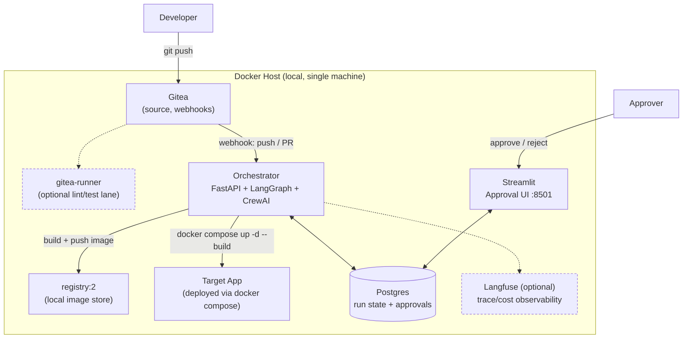
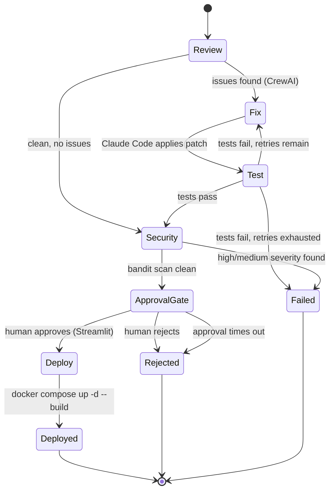

# Overseer

## AI-Governed CI/CD: A Multi-Agent Review, Fix, Test, and Deployment Control Plane

Reference architecture for running AI coding agents safely inside a real
software delivery pipeline — review, patch, test, and security-gate every
change automatically, and require a human sign-off before anything reaches
production.

Runs entirely on local Docker. No cloud dependency, no vendor lock-in.

---

## Executive Summary

Engineering teams are adopting AI coding agents faster than they're building
the guardrails around them. The result is two disconnected failure modes:
agents that make unreviewed changes with no consistent quality bar, and
release pipelines where review, testing, and deployment are still stitched
together by hand.

**Overseer** puts a governed pipeline in front of every code change: a crew
of specialized AI agents reviews it, fixes what it can, runs the tests, and
scans for security issues — all before a human ever needs to look at it.
The only manual step left is the one that should stay manual: the final
go/no-go on a production deploy.

> Enable AI-assisted development at team scale while keeping humans in
> control of what actually ships.

---

## Business Outcomes

- Cut the review-to-deploy cycle from hours/days to minutes for well-scoped changes
- Apply a consistent, repeatable quality bar to every change — no skipped steps under deadline pressure
- Free engineers from repetitive review/fix/test toil to focus on design and product work
- Keep a human decision-maker on every production deployment — no fully autonomous prod changes
- Full audit trail of what an agent changed, why, and who approved it
- Zero cloud spend on infrastructure — portable to on-prem, private cloud, or public cloud without re-architecture

---

## Why This Matters

Without a governed pipeline in front of AI coding agents, teams run into:

- Agent-written changes merged with inconsistent or no review
- No security gate between an agent's patch and a running deployment
- Manual, error-prone handoffs between review, test, and release
- No consistent record of what an agent changed or why
- Growing AI usage with no corresponding growth in delivery discipline

Overseer addresses this with a layered pipeline that combines multi-agent
review, automated testing, security scanning, and a human approval gate into
a single, self-hosted control plane.

---

## What Makes This Different

This is a **delivery control plane, not just a coding assistant.**

Claude Code making a good patch is one stage. The defensible part — and the
part that makes AI-assisted delivery safe to run unattended — is everything
around it:

- Structured multi-agent review before any patch is written
- An automatic retry loop bounded by a hard attempt cap (no runaway agent loops)
- A security gate that blocks on real findings, not just a lint pass
- A human approval gate that the pipeline cannot bypass
- Full state and audit trail for every run

Pipeline: `review → fix → test → security → approve → deploy`

---

## What's Here

| Path | What it is | Use it for |
|---|---|---|
| `docker-compose.yml` | Full local stack: Gitea, Postgres, registry, orchestrator, approval UI | Bringing the whole system up with one command |
| `orchestrator/` | FastAPI webhook + LangGraph state machine + CrewAI agents + Claude Code runner | The engineering core — the actual control plane logic |
| `orchestrator/nodes/` | One file per pipeline stage (reviewer, fixer, tester, security, approval, deploy) | Reading or extending any single stage in isolation |
| `approval-ui/` | Streamlit human-in-the-loop dashboard | The one manual checkpoint in the pipeline |
| `example-target-app/` | Small Flask app with a seeded bug + a failing test | A working demo of the full review→fix→test→approve→deploy loop |
| `.gitea-workflows-example/pipeline.yaml` | Optional lint/test lane via Gitea Actions | Fast feedback separate from the agentic flow |
| `scripts/init_db.sql`, `scripts/register_runner.sh` | DB schema, runner setup helper | First-time environment setup |

---

## Reference Architecture

Container-level view — everything runs as a Docker Compose service on a
single host, no external cloud dependency.



Dashed boxes/links are optional add-ons (lint-only CI lane, tracing) — the
core loop only needs Gitea, Orchestrator, Postgres, Registry, and the
Approval UI.

## Pipeline State Machine

What actually happens inside the Orchestrator once a webhook fires —
this is the LangGraph graph defined in `orchestrator/graph.py`.



Every terminal state (`Deployed`, `Rejected`, `Failed`) is written back to
the `runs` table in Postgres, so the Streamlit UI's "Recent history" panel
always reflects the true end state of a run.

---

## Quick Start

```bash
cp .env.example .env
# edit .env: set ANTHROPIC_API_KEY, POSTGRES_PASSWORD, WEBHOOK_SECRET

docker compose up -d postgres gitea registry
# open http://localhost:3000, create admin account, enable Actions in site config if desired

docker compose up -d --build orchestrator approval-ui

# In Gitea: Site Administration > Actions > Runners > generate a token, put it in .env as RUNNER_TOKEN
docker compose up -d runner
```

Then in Gitea:
1. Create a repo (or push the `example-target-app/` folder as your first test repo).
2. Repo Settings → Webhooks → Add Webhook → Gitea format.
   - Target URL: `http://orchestrator:8000/webhook`
   - Secret: same value as `WEBHOOK_SECRET` in `.env`
   - Trigger: Push events, Pull Request events
3. Push a commit. Watch the orchestrator logs: `docker compose logs -f orchestrator`.
4. Open `http://localhost:8501` to approve/reject the run once it reaches the gate.

Services once running:

| Service | URL |
|---|---|
| Gitea | http://localhost:3000 |
| Approval UI | http://localhost:8501 |
| Local registry | http://localhost:5000 |
| Langfuse (optional) | http://localhost:3001 |

---

## Stack

| Layer | Tool |
|---|---|
| Orchestration | LangGraph |
| Multi-agent reasoning | CrewAI (Reviewer, Security agents) |
| Code fixing | Claude Code (Agent SDK, headless `-p` mode) |
| Model backend | Direct Anthropic API, **or** a self-hosted LiteLLM proxy routing to local models (Ollama) — see below |
| Git hosting | Gitea |
| CI runner (optional, separate lint/test lane) | `gitea/runner` |
| Registry | `registry:2` |
| Approval UI | Streamlit |
| State | Postgres |
| Observability (optional) | Langfuse |

### Model backend modes

Overseer supports two backends, switched entirely via `.env` — no code
changes needed:

| Mode | Set in `.env` | Cost | Fixer quality |
|---|---|---|---|
| **A — Direct Anthropic** | `ANTHROPIC_API_KEY` | Pay per token | Best — Claude Code runs against real Claude models |
| **B — LiteLLM proxy (local models)** | `LITELLM_BASE_URL`, `LITELLM_API_KEY`, `ANTHROPIC_MODEL`, `ANTHROPIC_SMALL_FAST_MODEL`, `REVIEWER_MODEL` | Free (self-hosted) | Lower — local 7B–14B models are noticeably weaker at multi-file, tool-using edits; expect more Fixer retries |

In Mode B, both the CrewAI Reviewer/Security agents **and** Claude Code's
Fixer step route through the same LiteLLM proxy — Claude Code via
`ANTHROPIC_BASE_URL`/`ANTHROPIC_AUTH_TOKEN`, which it treats as a drop-in
replacement for the real Anthropic endpoint since LiteLLM speaks the
Anthropic Messages API. `ANTHROPIC_MODEL`/`ANTHROPIC_SMALL_FAST_MODEL`
remap Claude Code's internal `sonnet`/`haiku` aliases to real model names
registered in the proxy.

If you route the Reviewer to a reasoning model (e.g. DeepSeek-R1 via
Ollama), note it emits `<think>...</think>` traces before its answer —
`reviewer.py` strips these before parsing JSON, but it's worth a quick
manual test call against your proxy to confirm the raw output shape first.

---

## Expected Impact (illustrative)

These are directional estimates based on the pipeline's design, not
benchmarked production numbers — this is a portfolio MVP, not a fielded
system with usage history. Presented here as the reasoning behind the
architecture, not a performance claim.

| Stage | Manual process | With Overseer |
|---|---|---|
| Code review | Minutes–hours, queued behind a human reviewer | Seconds, always available |
| Fix for a flagged issue | Re-request, wait, re-review | Immediate, auto-tested before re-review |
| Security check | Often a separate, later-stage gate | Runs before every approval request |
| Release decision | Ad hoc, sometimes skipped under deadline pressure | Always required, always logged |

The one number worth stating plainly: **the approval gate cannot be
bypassed.** Every path through the state machine that ends in `Deployed`
passes through a human decision recorded in Postgres.

---

## Governance Example

An agent that can't produce a passing fix after repeated attempts is
automatically stopped rather than left to loop indefinitely:

- `MAX_FIX_ATTEMPTS` (default 3) caps the Fix → Test retry loop
- Exceeding it routes the run straight to `Failed` — no deploy, no silent retry forever
- A security finding always blocks the approval gate, regardless of test status
- An approval that sits unanswered past `APPROVAL_TIMEOUT_SECONDS` is treated
  as rejected, not left open indefinitely

This is the same instinct behind a cloud spend budget or a circuit
breaker — bound the blast radius of an automated system by default, not as
an afterthought.

---

## The Pitch in One Line

> Coding agents are getting good enough to ship changes on their own.
> Overseer is the control plane that makes that safe to allow.

---

## Strategic Benefits

### Governance
- Bounded retry loops (no runaway agent behavior)
- Mandatory human approval before production
- Full run history and audit trail in Postgres

### Automation
- Multi-agent review and fix loop, no human required until the gate
- Automatic test execution on every fix attempt
- Automatic build, push, and deploy on approval

### Quality
- Consistent review criteria applied to every change
- Security scan blocking on every run, not just spot-checked
- Structured, repeatable pipeline instead of ad hoc handoffs

### Portability
- Runs entirely on local Docker — no cloud account required
- No proprietary infra dependency in the core loop
- Same pattern extends to on-prem, private cloud, or public cloud later

---

## What's Real vs. Simplified in This MVP

This is a portfolio-grade MVP, not a hardened production system. Known
simplifications, called out on purpose rather than hidden:

- **Human-in-the-loop approval is poll-based** (orchestrator polls Postgres
  for a status flag), not LangGraph's native `interrupt()` + checkpoint
  resume. Simpler to reason about for a first version; swap in
  `langgraph.checkpoint.postgres` + `interrupt()` for a production version
  that survives orchestrator restarts mid-run.
- **`--dangerously-skip-permissions`** is used for the Claude Code fixer step.
  This is only safe because the orchestrator itself runs in an isolated
  container with no host volume mounts other than the scoped repo workspace.
  Do not run this flag against a container that mounts your home directory.
- **Docker socket is mounted** into the runner and orchestrator so they can
  build/run containers on the host. This is a known privilege-escalation
  surface — acceptable for a local demo, called out as a gap for anyone
  reviewing this for production readiness. Rootless DinD is the upgrade path.
- **Langfuse is optional** (`docker compose --profile observability up`) since
  full self-hosted setup needs its own secrets (NEXTAUTH_SECRET, SALT,
  ENCRYPTION_KEY) — see comments in `docker-compose.yml`.
- **CrewAI agents use the Anthropic API directly** (via `ANTHROPIC_API_KEY`)
  for reasoning tasks (review, security triage) in Mode A, or the LiteLLM
  proxy in Mode B. Claude Code itself is only invoked for the Fixer step,
  since that's the one step that needs real file edits and repo-aware
  tool use.
- **If running Mode B (LiteLLM), pin your LiteLLM version deliberately.**
  Anthropic's own gateway docs have flagged specific past LiteLLM PyPI
  releases as compromised with credential-stealing malware. Check
  `pip show litellm` before relying on a proxy for anything beyond local
  experimentation, and rotate credentials if an affected version was ever
  installed.

---

## Going to Production

- Swap poll-based approval for LangGraph `interrupt()` + Postgres checkpointer
- Add Langfuse tracing calls in each node (`@observe()` decorator)
- Replace socket-mounted runner with rootless Docker-in-Docker
- Add a `--diff-only` mode so Reviewer/Fixer only touch changed files, not
  the whole repo, to control Claude Code token spend
- Make the test command configurable per target repo (`.overseer.yaml`)
  instead of hardcoding `pytest`
- Add per-team budget/quota controls on Claude Code and CrewAI API usage,
  the same way a cloud FinOps layer caps spend per team

---

## Repo Layout

```
overseer/
├── docker-compose.yml
├── .env.example
├── orchestrator/          # FastAPI + LangGraph + CrewAI + Claude Code runner
│   ├── main.py            # webhook entrypoint
│   ├── graph.py           # LangGraph state machine
│   ├── state.py           # PipelineState schema
│   ├── db.py              # Postgres helpers
│   ├── config.py          # env config
│   ├── claude_code_runner.py
│   └── nodes/
│       ├── reviewer.py    # CrewAI agent
│       ├── fixer.py       # Claude Code headless call
│       ├── tester.py      # pytest runner
│       ├── security.py    # bandit runner
│       ├── approval.py    # poll Postgres for human decision
│       └── deploy.py      # docker compose up on target repo
├── approval-ui/           # Streamlit approval dashboard
├── scripts/
│   ├── init_db.sql
│   └── register_runner.sh
├── .gitea-workflows-example/
│   └── pipeline.yaml      # optional lint/test lane via Gitea Actions
└── example-target-app/    # tiny Flask app + a failing test, for demoing the loop
```
